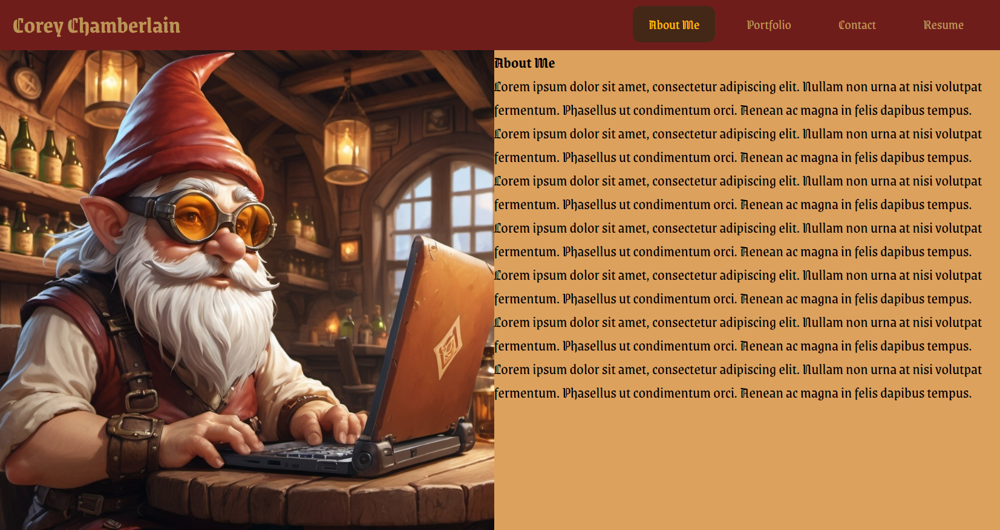

# <React-Portfolio>

## Description

This is a portfolio to showcase my skills in react and a number of my previous projects to potential employers.

## Usage

To run the project locally you must first enter "npm install" to install the dependencies and then enter "npm run start" 

## Credits
Traversy Media

https://www.youtube.com/watch?v=LDB4uaJ87e0&list=LL&index=6&t=1571s

## License
MIT 
